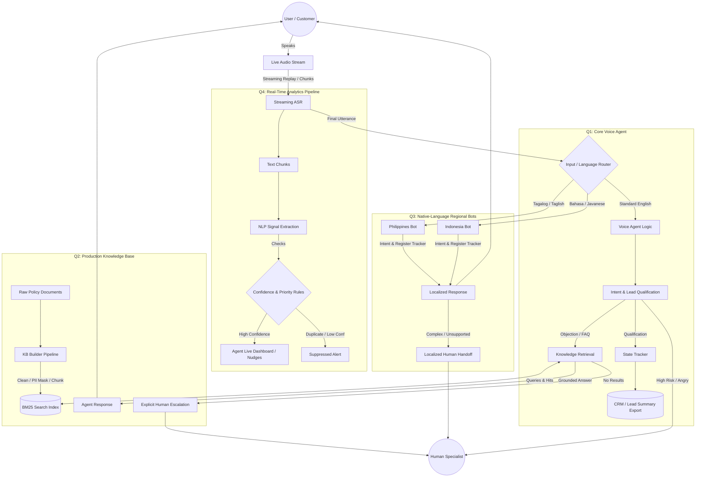

# Darwix AI — Conversational AI Ecosystem

## 1. Executive Summary
Darwix AI is a conversational AI ecosystem prototype built for the AI Engineer Assessment. It demonstrates a knowledge-grounded voice agent, a production-ready knowledge base, native-language regional voice bots, and a live insights pipeline for call audio. The system is designed to provide safe, traceable, and bounded conversational experiences with explicit fallbacks and real-time processing capabilities.

## 2. Assessment Coverage
This repository addresses the four primary requirements of the assessment:
- **Q1:** Knowledge-Grounded Voice Agent
- **Q2:** Production-Ready Knowledge Base
- **Q3:** Native-Language Voice Bots (Philippines & Indonesia)
- **Q4:** Live Insights and Nudges from Call Audio (Text-chunk simulation)

## 3. Architecture

The architecture separates deterministic business logic (qualification, state tracking) from the knowledge retrieval (BM25) and analytics pipelines (signal extraction).

## 4. Repository Structure
```
darwix-ai/
├── knowledge_system/    # Q2: BM25 extraction, cleaning, and retrieval pipeline
├── voice_assistant/     # Q1: Knowledge-grounded voice agent logic and scenarios
├── regional_bots/       # Q3: Philippines and Indonesia localization bots
├── realtime_analytics/  # Q4: Live signal extraction and nudge delivery pipeline
├── tools/               # Test execution and evidence generation tools
├── test_reports/        # Generated regression results and test outputs
├── README.md
```

## 5. Q1 — Knowledge-Grounded Voice Agent
The voice assistant handles dynamic lead qualification, objections, and out-of-scope inquiries.
- **Dynamic Routing:** Identifies cooperative paths, objections, and missing/conflicting information.
- **Safety First:** Explicit fallbacks are triggered for out-of-scope topics or unsupported business cases.
- **Structured Output:** Automatically structures conversational data into a CRM-ready Lead Summary.

## 6. Q2 — Production Knowledge Base
The knowledge base transforms raw unstructured documents into a searchable index.
- **Pipeline:** Raw data → Boilerplate cleaning → PII masking → Chunking & Deduplication → BM25 Indexing.
- **PII Protection:** Automatically masks sensitive information like phone numbers and email addresses before indexing.
- **Traceability:** Every retrieval result includes a source reference and category to verify its origin.

## 7. Q3 — Regional Bots
The regional bots implement nuanced localization strategies rather than literal translation.
- **Philippines:** Handles English, Tagalog, and natural Taglish seamlessly. Recognizes sector-specific vocabulary.
- **Indonesia:** Accommodates formal Bahasa Indonesia, colloquial speech, and English finance loanwords, with fallbacks for Javanese-influenced terminology (e.g., *kulo*, *pripun*).

## 8. Q4 — Real-Time Analytics
The real-time analytics pipeline simulates live call processing.
- **Streaming Pipeline:** Evaluates text chunks to simulate streaming inputs.
- **Live Signals:** Detects missed cross-sells, compliance gaps, and customer frustration.
- **Controls:** Implements confidence thresholds, duplicate suppression, and priority logic to prevent alert spam.

## 9. Key Technical Decisions
- **Loose Coupling:** The four core components operate independently to ensure modularity.
- **Deterministic Business Logic:** Intent detection and state routing are kept separate from LLM creativity to guarantee consistent escalation behaviors.

## 10. Retrieval Design
The retrieval system uses an optimized **Okapi BM25** implementation. It includes:
- Custom stopword filtering and synonym normalization (e.g., standardizing "wife", "spouse", "children" to "family").
- Category-based and tag-based score boosting to improve relevance.
- Fallback thresholds to avoid returning low-confidence results.

## 11. Grounding and Fallback
Responses are grounded in retrieved knowledge. When supporting information is unavailable, the agent executes an explicit fallback rather than inventing an answer.
- **Example:** "I don't have that information in the current knowledge base, so I don't want to guess. I can connect you with a human specialist."

## 12. Localization Strategy
Localization goes beyond language translation to include cultural and sector-specific registers.
- Bots maintain the conversational tone (formal vs. colloquial) of the user.
- Explicit handoffs to human agents are executed smoothly in the local language without abrupt switches to English.

## 13. Real-Time Pipeline
The pipeline processes interaction chunks sequentially to simulate a streaming environment. It tracks topic shifts (e.g., moving from "payment" to "vehicle") to provide contextual nudges.

## 14. Latency Measurement
Latency metrics are gathered through simulated processing runs (`time.sleep` mocks).
- **P50 / P95 Latency:** Available in the generated test reports, typically ranging from 5-8ms per text chunk (simulated).

## 15. Test Results
The repository includes a comprehensive regression suite.
- **Status:** `81/81` tests currently passing (verified via `python tools/regression_matrix.py`).

## 16. Evidence
Test reports and evaluations are actively generated via the `tools/generate_evidence.py` script. The results are stored in the `test_reports/` directory, detailing transcripts, retrieval hits, and evaluation metrics. *(Note: Manual audio recordings and full `evidence/` directory structure remain as a pending manual task)*.

## 17. Setup
```bash
# Clone the repository
git clone <repository_url>
cd darwix-ai

# Set up virtual environment (optional but recommended)
python -m venv venv
source venv/bin/activate  # On Windows: venv\Scripts\activate

# The project uses standard Python libraries. No external pip dependencies are required for the core pipeline.
```

## 18. Running the System
To run the automated regression matrix:
```bash
python tools/regression_matrix.py
```
To generate test evidence and build the knowledge base:
```bash
python tools/generate_evidence.py
```

## 19. Environment Variables
No secrets are required to run the current regression suite. For production deployment, you would need:
```
API_KEY=
MODEL_NAME=
ASR_PROVIDER=
TTS_PROVIDER=
```
See `.env.example` (to be created) for a template.


## 20. Production Improvements
- Integrate a real streaming ASR service (e.g., Deepgram or Whisper live) for Q4.
- Implement vector embeddings alongside BM25 for hybrid search in Q2.
- Integrate an LLM to dynamically synthesize the BM25 retrieval results with natural language explanations.
- Deploy components as independent microservices (e.g., via FastAPI or gRPC).

## 21. Assessment Requirement Mapping
- **Knowledge-Grounded Agent:** Met (Q1, `voice_assistant/src/agent.py`)
- **Production Knowledge Base:** Partially Met (Q2, `knowledge_system/src/`, lacks relevance explanation)
- **Native-Language Bots:** Met (Q3, `regional_bots/src/`)
- **Real-Time Analytics:** Partially Met (Q4, `realtime_analytics/src/`, uses simulated text chunks instead of audio replay)
