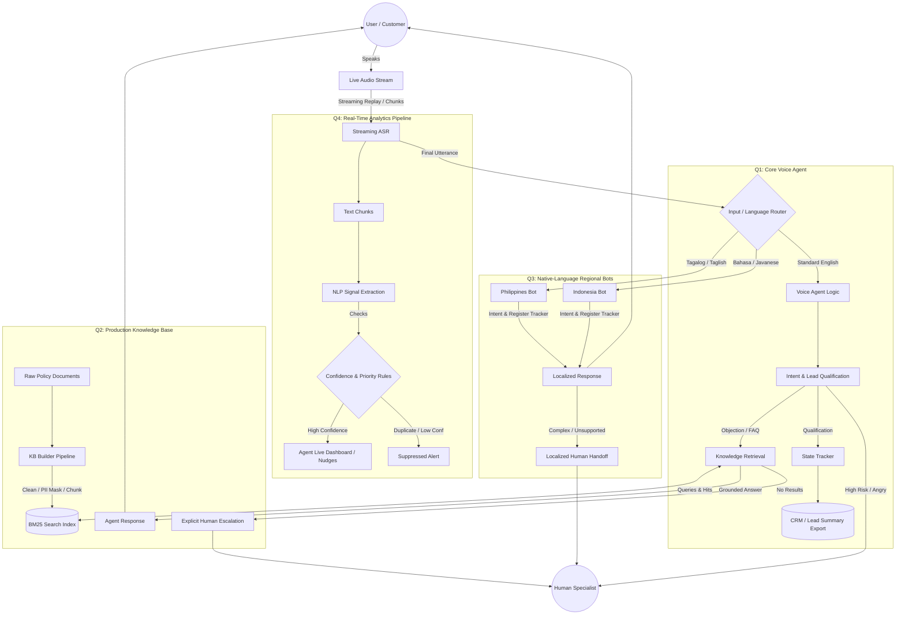

# System Architecture — Darwix AI

This document outlines the unified architecture for the Darwix AI Conversational AI Ecosystem, demonstrating how all four primary components (Voice Agent, Knowledge Base, Regional Bots, and Real-Time Analytics) interconnect.

## 1. Unified Architecture Diagram

The diagram below shows the complete data flow from the user's voice input down through the real-time processing and conversational state handlers.

---

## 2. Component Interconnections

### Audio Intake to Dual Processing (Q1/Q3 & Q4)
The system leverages a dual-path architecture. Audio from the caller is transcribed into text chunks. 
- **Path 1 (Q4):** Partial, live text chunks stream directly into the `Real-Time Analytics Pipeline`. This pipeline detects signals (frustration, compliance gaps) mid-sentence and delivers nudges to the agent dashboard without waiting for the user to finish speaking.
- **Path 2 (Q1 & Q3):** Once the utterance is complete, it is passed to the language router, which categorizes the input into standard English for the Core Voice Agent, or localized dialects for the Regional Bots.

### Knowledge Retrieval (Q1 ↔ Q2)
When the core Voice Agent detects an FAQ or objection, it pauses state tracking and queries the BM25 index. The BM25 system processes the raw policy documents, masks PII, and returns chunked, source-linked text. If a high-confidence match is found, the Voice Agent responds. If not, it executes a strict fallback.

### Escaping the Automated Loop
To ensure safety and reliability, three distinct fallback paths exist:
1. **Knowledge Miss:** No relevant policy documents found.
2. **Unsupported Request:** Regional bots or Core agent detect intents beyond their capability.
3. **High Risk:** Angry customers or explicit human-handoff requests are routed to a human specialist with all conversational context preserved.
